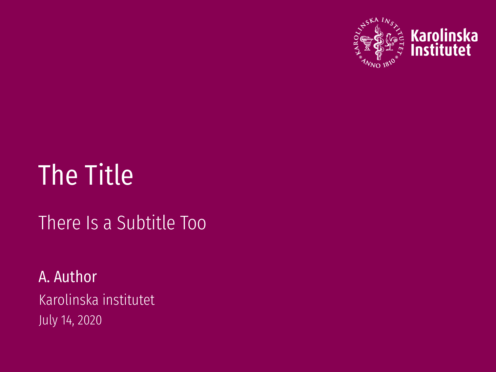

# `miniki` - A Beamer theme

A minimal-looking theme styled to fit the Karolinska Institutet branding.

This is an unofficial theme, and the included logo is copyright of Karolinska Institutet.

This theme has been forked from the [Manc](https://github.com/ibab/beamertheme-manc) Beamer theme, with modifications to fit my taste.

_Manc_ takes lots of ideas from:

* [The metropolis theme](https://github.com/matze/mtheme)
* [The tudoposter theme](https://github.com/MaxNoe/tudoposter)

## Requirements

* The document must be compiled using `xelatex`, as the `fontspec` package is required;
* The [Fira](https://github.com/mozilla/Fira) font stack;
* The [Fira Code](https://github.com/tonsky/FiraCode) monospaced font;
* The [Latin Modern Math](http://www.gust.org.pl/projects/e-foundry/lm-math) font (for, well, you guessed it, math).

## Using the theme

You can use this theme by including

```latex
\usebeamertheme{miniki}
```
in the header of your presentation.

The theme can be customised by setting the value of supported options:

```latex
\usebeamertheme[booleanOption, keywordOption = value]{miniki}
```
The currently supported options are:

* `fullfootline`, boolean, activates footline information (short title, short author);
* `background`, keyword, sets a picture as the title background. If this option is not given, the primary color is used to create a solid background;
* `primaryColor`, keyword, the primary color to use for the theme, in HEX format. Defaults to KI plum;
* `primaryLightColor`, keyword, this is intended to be a lighter version of the primary color (also in HEX format). Defaults to KI Cyclamen.

You can read more about the [KI colour palette here](https://staff.ki.se/colour-palette).

## Demos

See [default.pdf](./default.pdf) for the default look of the theme:

[](./default.pdf)

[](./default.pdf)
